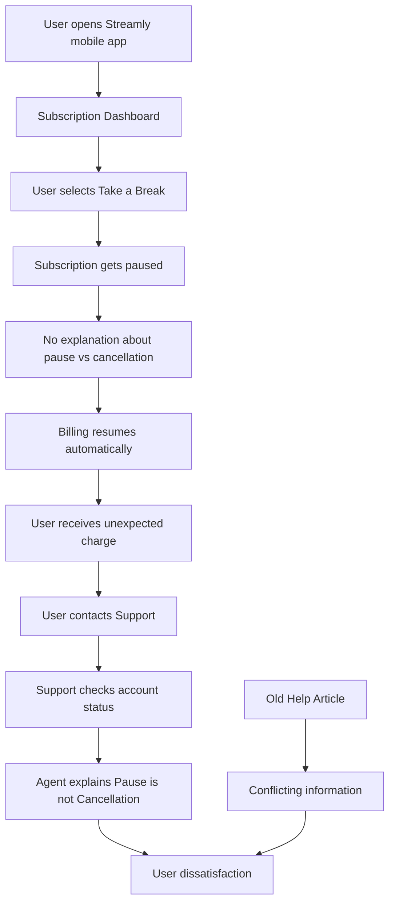
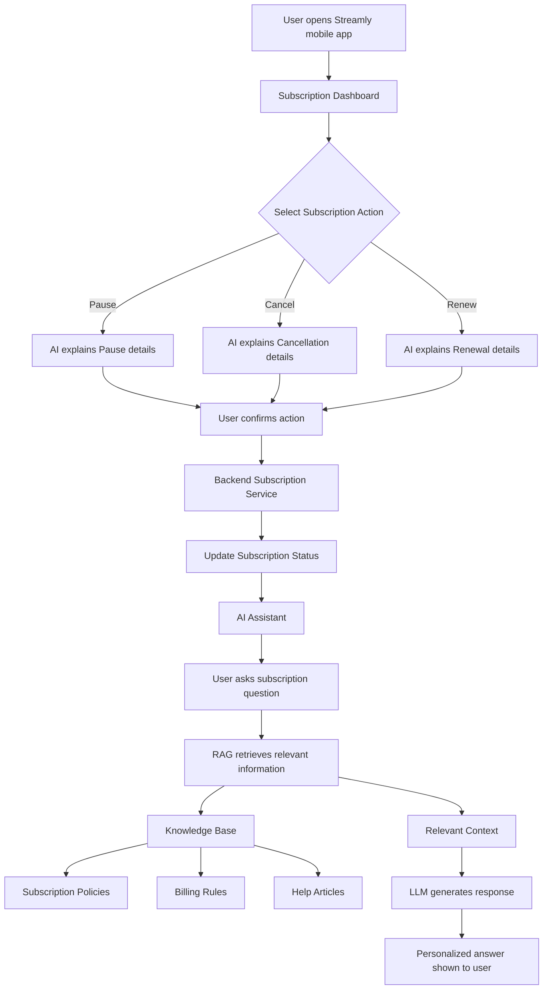
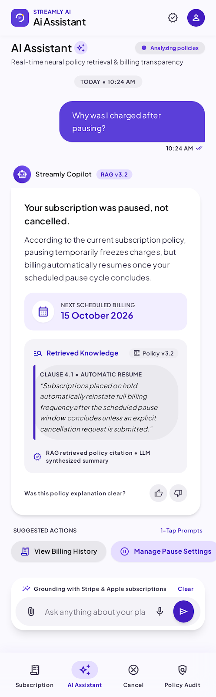
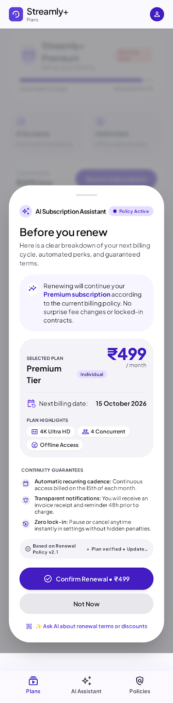

<h1 align="center">
  
   
  Streamly
</h1>

  <strong>AI-powered subscription clarity and billing assistant</strong>

  Streamly uses RAG and LLM technology to provide clear subscription explanations and reduce billing confusion.

---

## Original System Flow (Without Our Implementation)

## Our AI-Powered Implementation Flow

## Prototype

|  |  